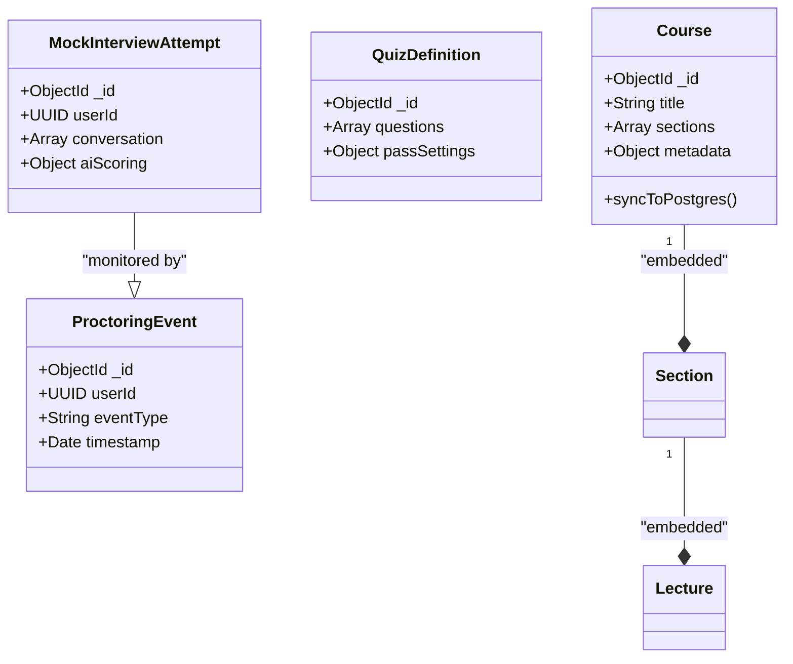

# Database ERD & Data Models

This document presents the visual mapping of the UGSkill hybrid database architecture, combining PostgreSQL (Relational/SSOT) and MongoDB (Document/High-Scale).

## 1. PostgreSQL ERD (Relational)

PostgreSQL serves as the primary source of truth for relationships, auth, and financial/audit data.

```mermaid
erDiagram
    subgraph Core
        USERS ||--o{ USER_SESSIONS : "has"
        USERS ||--o{ BATCH_MEMBERS : "belongs to"
        BATCHES ||--o{ BATCH_MEMBERS : "contains"
        USERS ||--o{ AUDIT_LOGS : "acts in"
    end

    subgraph LMS
        USERS ||--o{ ENROLLMENTS : "enrolls"
        COURSE_CATALOG ||--o{ ENROLLMENTS : "is enrolled in"
        ROADMAP_CATALOG ||--o{ ENROLLMENTS : "is enrolled in"
        USERS ||--o{ LECTURE_COMPLETIONS : "completes"
        USERS ||--o{ QUIZ_ATTEMPTS : "takes"
        USERS ||--o{ PROGRESS_SUMMARY : "has"
        BATCHES ||--o{ BATCH_COURSE_ACCESS : "has access"
    end

    subgraph Placement
        COMPANIES ||--o{ COMPANY_DRIVES : "hosts"
        COMPANY_DRIVES ||--o{ DRIVE_REGISTRATIONS : "lists"
        USERS ||--o{ DRIVE_REGISTRATIONS : "applies"
        USERS ||--o{ READINESS_SCORES : "has"
        GD_SESSIONS ||--o{ GD_PARTICIPANTS : "includes"
        USERS ||--o{ GD_PARTICIPANTS : "joins"
    end

    subgraph Exam
        EXAMS ||--o{ EXAM_SECTIONS : "contains"
        EXAMS ||--o{ EXAM_ATTEMPTS : "taken by students"
        EXAM_ATTEMPTS ||--o{ EXAM_SCORES : "generates"
        BATCHES ||--o{ EXAM_BATCH_ACCESS : "allowed for"
    end

    USERS {
        uuid id PK
        string email
        string full_name
        enum role
        timestamp created_at
    }

    COURSE_CATALOG {
        uuid id PK
        string title
        uuid mongo_id FK "References Mongo Course"
        boolean is_active
    }

    ENROLLMENTS {
        uuid id PK
        uuid user_id FK
        uuid course_id FK
        timestamp enrolled_at
    }
```

---

## 2. MongoDB Collection Map (Document)

MongoDB stores deep, nested, and high-frequency data (Content, Logs, Definitions).

---

## 3. Hybrid Synchronization (The "Glue")

We use **UUIDs** as the primary join key between Postgres and MongoDB.

- **Postgres** holds the `mongo_id` (ObjectId string) to reference deep content.
- **MongoDB** holds the `userId` (UUID string) to associate content with the relational user record.

### Key Mappings
| Entity | PostgreSQL (SQL) | MongoDB (NoSQL) | Link Key |
|---|---|---|---|
| **User** | `users` | `user_snapshots` | `user_id` |
| **Course** | `course_catalog` | `courses` | `mongo_id` |
| **Quiz** | `quiz_attempts` | `quiz_attempt_details` | `attempt_id` |
| **Activity** | `progress_summary` | `activity_events` | `user_id` |
| **Exam** | `exam_attempts` | `exam_responses` | `attempt_id` |

---

## 4. Partitioning Strategy (PostgreSQL)

The following tables are physically partitioned by **Range** to ensure long-term performance:
1.  `audit_logs`: Partitioned by `created_at` (Monthly).
2.  `notification_logs`: Partitioned by `created_at` (Monthly).
3.  `exam_scores`: Partitioned by `exam_id` (Hash/Range).
