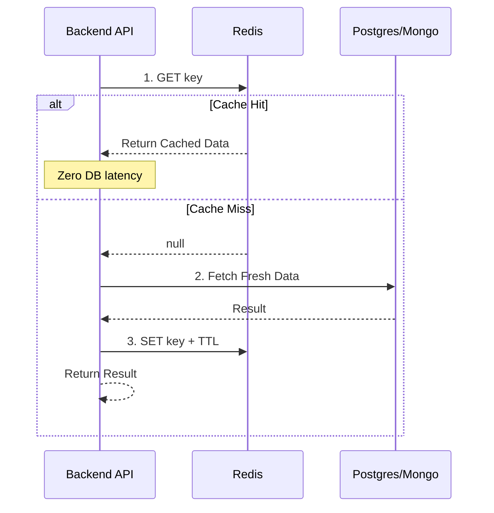
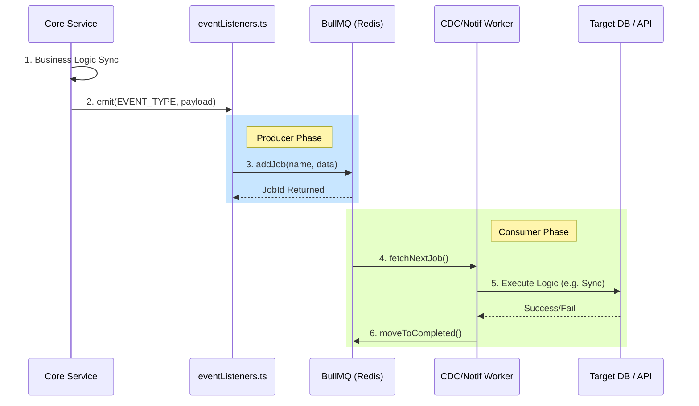
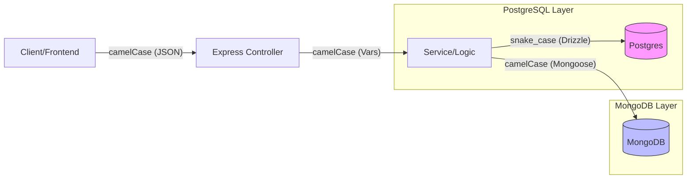
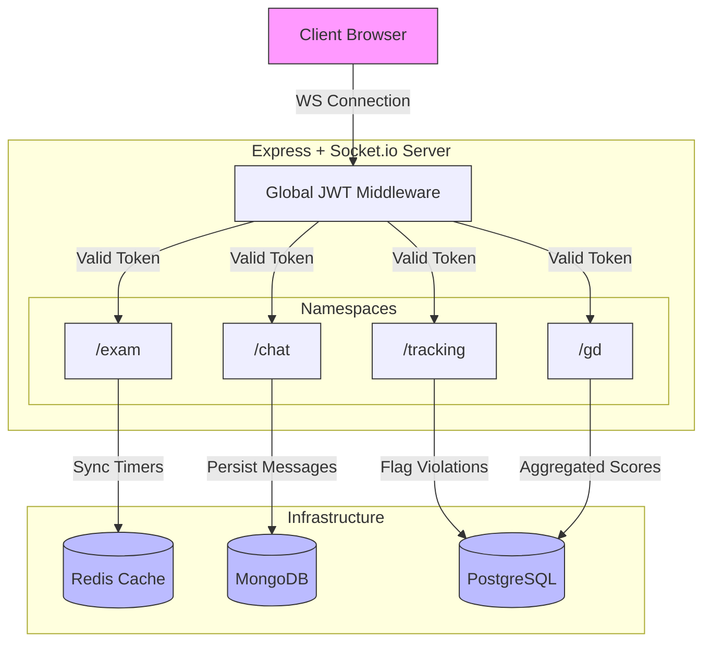

# Project Infrastructure & Conventions

This document details the core technical pillars of the UGSkill backend, including communication patterns, database synchronization, and coding standards.

## 1. Caching Strategy (Redis)

The platform utilizes **Redis** for high-performance data retrieval using the **Cache-aside (Lazy Loading)** pattern.

### Implementation Details
- **Library**: `ioredis`
- **Helper**: `src/lib/cache.ts`
- **Primary Tool**: `fetchWithCache<T>(key, fetchFn, ttlSeconds)`

---

## 2. Queuing & Event System (BullMQ)

High-fidelity breakdown of how background tasks are offloaded.

### Detailed Lifecycle

---

## 3. CDC (Change Data Capture) Flow

The "Dual-DB" strategy requires PostgreSQL (Relational) and MongoDB (Document) to stay in sync.

| Source DB | Target DB | Entity | Trigger Event | Result |
|---|---|---|---|---|
| MongoDB | PostgreSQL | Courses | `COURSE_UPDATED` | Updates `course_catalog` |
| MongoDB | PostgreSQL | Activity | `ACTIVITY_COMPLETED` | Updates `progress_summary` |
| PostgreSQL | MongoDB | User | `USER_UPDATED` | Updates `user_snapshots` |
| MongoDB | PostgreSQL | Scores | `MOCK_SCORED` | Updates `readiness_scores` |

---

## 4. Casing & Coding Conventions

### Data Transformation Flow
How we handle casing across the full stack layers.

### Reference Table
| Context | Case Style | Example |
|---|---|---|
| **PostgreSQL** | `snake_case` | `user_id`, `updated_at` |
| **MongoDB** | `camelCase` | `userId`, `lastAttemptDate` |
| **TypeScript** | `camelCase` | `const userData = ...` |
| **API Responses** | `camelCase` | `{ "success": true, "data": { ... } }` |

---

## 5. Real-Time Architecture (Socket.io)

For capabilities like live proctoring, exam timers, and group discussions, we utilize a strict namespace-partitioned WebSocket design.

### WebSockets Connection & Message Passing

