# Backend Development Chunks — Deep Architecture Guide

This document details the exact internal mechanics of every development chunk. Each section documents the real files, functions, and data flows as they exist in the codebase.

---

## Development Timeline

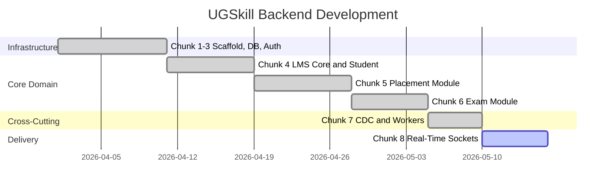
```mermaid
gantt
    title UGSkill Backend Development
    dateFormat  YYYY-MM-DD
    section Infrastructure
    Chunk 1-3 Scaffold, DB, Auth     :done, c1, 2026-04-01, 10d
    section Core Domain
    Chunk 4 LMS Core and Student     :done, c2, after c1, 8d
    Chunk 5 Placement Module         :done, c3, after c2, 9d
    Chunk 6 Exam Module              :done, c4, after c3, 7d
    section Cross-Cutting
    Chunk 7 CDC and Workers          :done, c5, after c4, 5d
    section Delivery
    Chunk 8 Real-Time Sockets        :active, c6, after c5, 6d
```

---

## Chunk 1 — Project Scaffold & Infrastructure

**Goal**: Initialize the Express application with all essential middleware, database connections, and health monitoring.

### How it Works: The Request Pipeline

Every HTTP request passes through these exact layers, in this exact order:

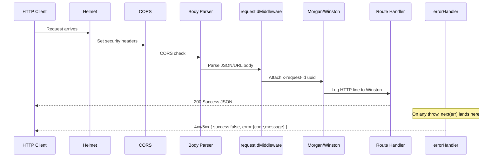
```mermaid
sequenceDiagram
    participant C as HTTP Client
    participant H as Helmet
    participant CO as CORS
    participant BP as Body Parser
    participant RID as requestIdMiddleware
    participant M as Morgan/Winston
    participant R as Route Handler
    participant EH as errorHandler

    C->>H: Request arrives
    H->>CO: Set security headers
    CO->>BP: CORS check
    BP->>RID: Parse JSON/URL body
    RID->>M: Attach x-request-id uuid
    M->>R: Log HTTP line to Winston
    R-->>C: 200 Success JSON
    note over EH: On any throw, next(err) lands here
    EH-->>C: 4xx/5xx { success:false, error:{code,message} }
```

### How it Works: The Health Check

`GET /api/v1/health` tests all three database connections in parallel:

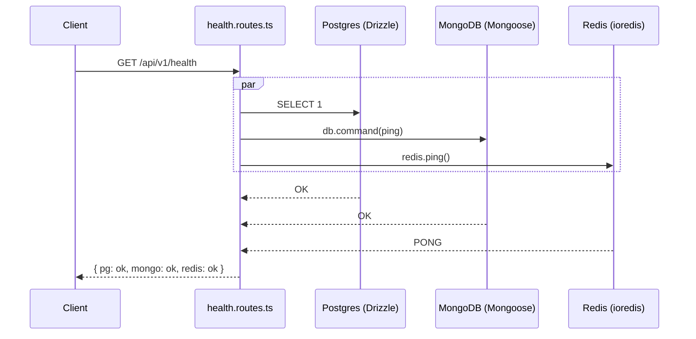
```mermaid
sequenceDiagram
    participant Client
    participant Health as health.routes.ts
    participant PG as Postgres (Drizzle)
    participant MG as MongoDB (Mongoose)
    participant RD as Redis (ioredis)

    Client->>Health: GET /api/v1/health
    par
        Health->>PG: SELECT 1
        Health->>MG: db.command(ping)
        Health->>RD: redis.ping()
    end
    PG-->>Health: OK
    MG-->>Health: OK
    RD-->>Health: PONG
    Health-->>Client: { pg: ok, mongo: ok, redis: ok }
```

---

## Chunk 2 — Database Schema Layer

**Goal**: Define every table and collection as typed code. Zero raw SQL — everything is Drizzle (PG) or Mongoose (Mongo).

### How it Works: The Schema Architecture

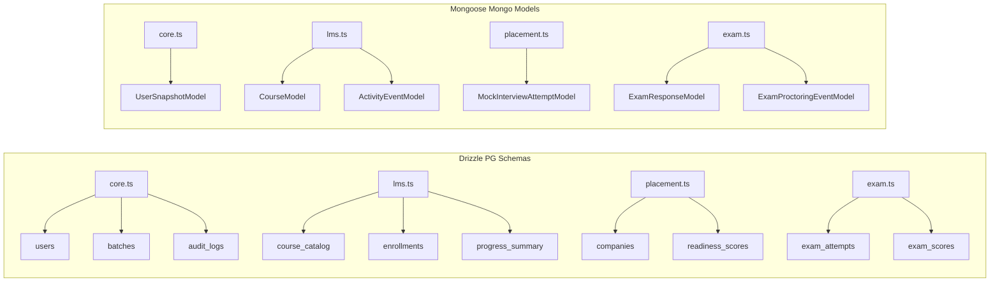
```mermaid
flowchart LR
    subgraph Drizzle PG Schemas
        core.ts --> users
        core.ts --> batches
        core.ts --> audit_logs
        lms.ts --> course_catalog
        lms.ts --> enrollments
        lms.ts --> progress_summary
        placement.ts --> companies
        placement.ts --> readiness_scores
        exam.ts --> exam_attempts
        exam.ts --> exam_scores
    end

    subgraph Mongoose Mongo Models
        core.ts2[core.ts] --> UserSnapshotModel
        lms.ts2[lms.ts] --> CourseModel
        lms.ts2 --> ActivityEventModel
        placement.ts2[placement.ts] --> MockInterviewAttemptModel
        exam.ts2[exam.ts] --> ExamResponseModel
        exam.ts2 --> ExamProctoringEventModel
    end
```

### How it Works: The Dual-ID Strategy

The two databases are linked via IDs embedded in each other:

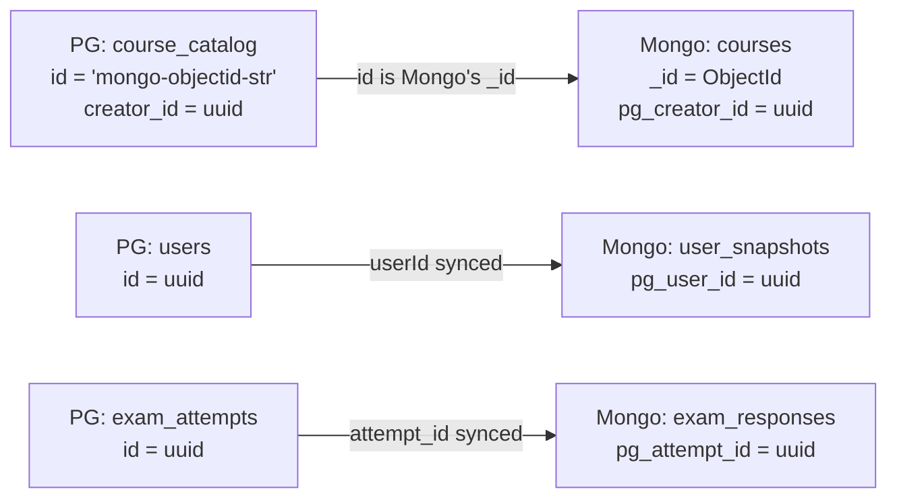
```mermaid
flowchart LR
    PG_course["PG: course_catalog\n id = 'mongo-objectid-str'\n creator_id = uuid"] -- "id is Mongo's _id" --> MG_course["Mongo: courses\n _id = ObjectId\n pg_creator_id = uuid"]

    PG_user["PG: users\n id = uuid"] -- "userId synced" --> MG_snap["Mongo: user_snapshots\n pg_user_id = uuid"]

    PG_exam["PG: exam_attempts\n id = uuid"] -- "attempt_id synced" --> MG_resp["Mongo: exam_responses\n pg_attempt_id = uuid"]
```

---

## Chunk 3 — Auth & Users

**Goal**: JWT-based authentication with refresh token rotation, RBAC, and full audit logging.

### How it Works: Register Flow

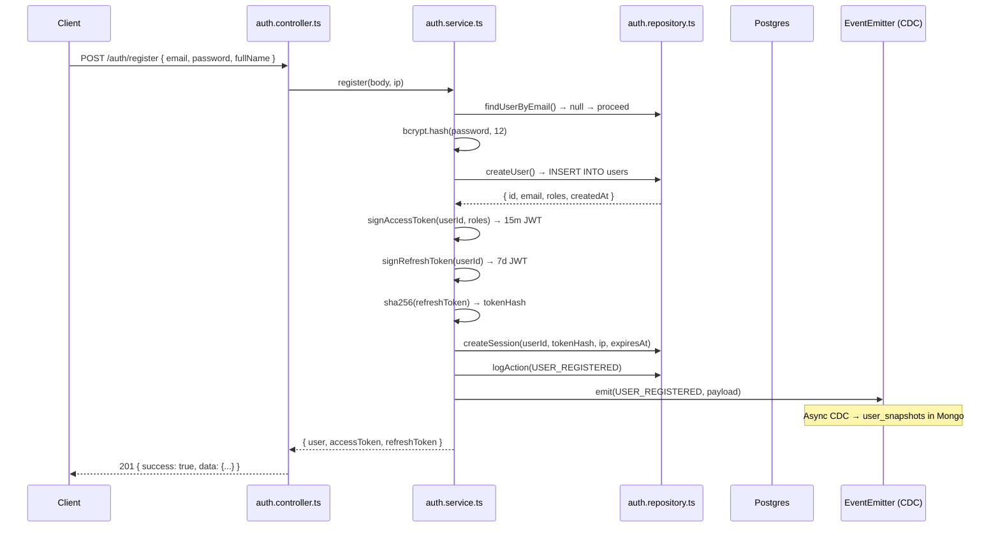
```mermaid
sequenceDiagram
    participant C as Client
    participant AC as auth.controller.ts
    participant AS as auth.service.ts
    participant AR as auth.repository.ts
    participant PG as Postgres
    participant EE as EventEmitter (CDC)

    C->>AC: POST /auth/register { email, password, fullName }
    AC->>AS: register(body, ip)
    AS->>AR: findUserByEmail() → null → proceed
    AS->>AS: bcrypt.hash(password, 12)
    AS->>AR: createUser() → INSERT INTO users
    AR-->>AS: { id, email, roles, createdAt }
    AS->>AS: signAccessToken(userId, roles) → 15m JWT
    AS->>AS: signRefreshToken(userId) → 7d JWT
    AS->>AS: sha256(refreshToken) → tokenHash
    AS->>AR: createSession(userId, tokenHash, ip, expiresAt)
    AS->>AR: logAction(USER_REGISTERED)
    AS->>EE: emit(USER_REGISTERED, payload)
    Note over EE: Async CDC → user_snapshots in Mongo
    AS-->>AC: { user, accessToken, refreshToken }
    AC-->>C: 201 { success: true, data: {...} }
```

### How it Works: Refresh Token Rotation

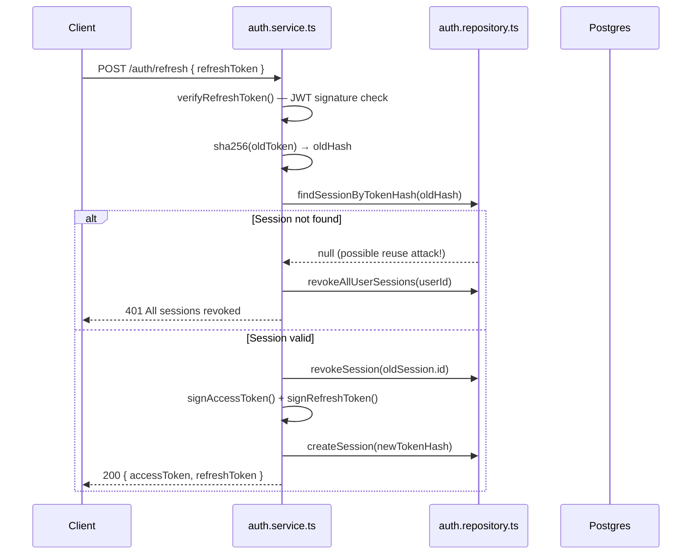
```mermaid
sequenceDiagram
    participant C as Client
    participant AS as auth.service.ts
    participant AR as auth.repository.ts
    participant PG as Postgres

    C->>AS: POST /auth/refresh { refreshToken }
    AS->>AS: verifyRefreshToken() — JWT signature check
    AS->>AS: sha256(oldToken) → oldHash
    AS->>AR: findSessionByTokenHash(oldHash)
    alt Session not found
        AR-->>AS: null (possible reuse attack!)
        AS->>AR: revokeAllUserSessions(userId)
        AS-->>C: 401 All sessions revoked
    else Session valid
        AS->>AR: revokeSession(oldSession.id)
        AS->>AS: signAccessToken() + signRefreshToken()
        AS->>AR: createSession(newTokenHash)
        AS-->>C: 200 { accessToken, refreshToken }
    end
```

### How it Works: RBAC Middleware

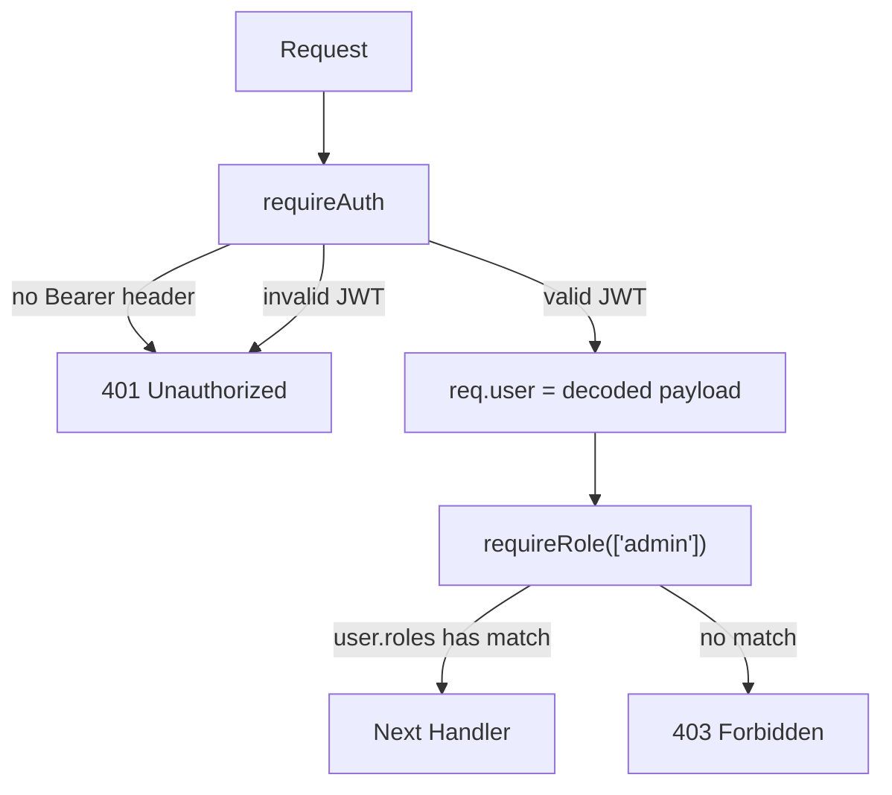
```mermaid
flowchart TD
    Request --> requireAuth
    requireAuth -- "no Bearer header" --> 401[401 Unauthorized]
    requireAuth -- "invalid JWT" --> 401
    requireAuth -- "valid JWT" --> AttachUser["req.user = decoded payload"]
    AttachUser --> requireRole["requireRole(['admin'])"]
    requireRole -- "user.roles has match" --> next[Next Handler]
    requireRole -- "no match" --> 403[403 Forbidden]
```

---

## Chunk 4 — LMS Module

**Goal**: Full content management (Courses, Roadmaps, Lectures) with dual-database sync, student progress tracking, and streaks.

### How it Works: Course Create & Sync

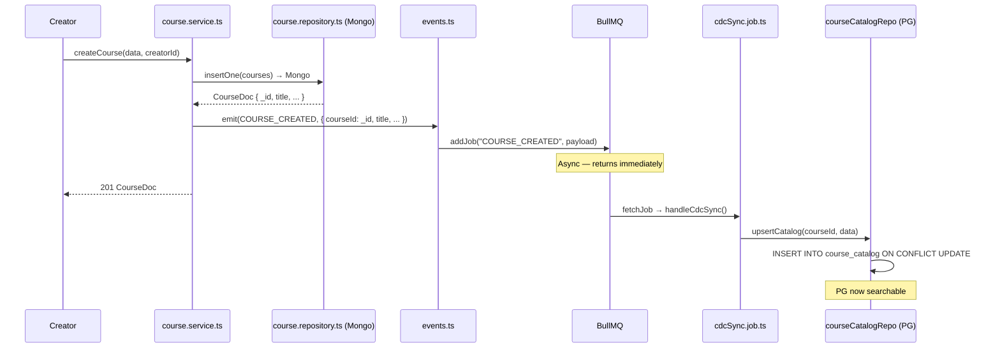
```mermaid
sequenceDiagram
    participant C as Creator
    participant CS as course.service.ts
    participant CR as course.repository.ts (Mongo)
    participant EE as events.ts
    participant BQ as BullMQ
    participant CDC as cdcSync.job.ts
    participant CC as courseCatalogRepo (PG)

    C->>CS: createCourse(data, creatorId)
    CS->>CR: insertOne(courses) → Mongo
    CR-->>CS: CourseDoc { _id, title, ... }
    CS->>EE: emit(COURSE_CREATED, { courseId: _id, title, ... })
    EE->>BQ: addJob("COURSE_CREATED", payload)
    Note over BQ: Async — returns immediately
    CS-->>C: 201 CourseDoc

    BQ->>CDC: fetchJob → handleCdcSync()
    CDC->>CC: upsertCatalog(courseId, data)
    CC->>CC: INSERT INTO course_catalog ON CONFLICT UPDATE
    Note over CC: PG now searchable
```

### How it Works: Lecture Completion & Streak

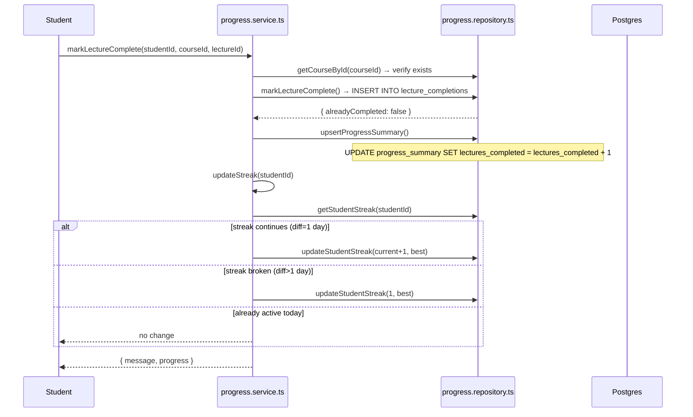
```mermaid
sequenceDiagram
    participant S as Student
    participant PS as progress.service.ts
    participant PR as progress.repository.ts
    participant PG as Postgres

    S->>PS: markLectureComplete(studentId, courseId, lectureId)
    PS->>PR: getCourseById(courseId) → verify exists
    PS->>PR: markLectureComplete() → INSERT INTO lecture_completions
    PR-->>PS: { alreadyCompleted: false }
    PS->>PR: upsertProgressSummary()
    Note over PR: UPDATE progress_summary SET lectures_completed = lectures_completed + 1
    PS->>PS: updateStreak(studentId)
    PS->>PR: getStudentStreak(studentId)
    alt streak continues (diff=1 day)
        PS->>PR: updateStudentStreak(current+1, best)
    else streak broken (diff>1 day)
        PS->>PR: updateStudentStreak(1, best)
    else already active today
        PS-->>S: no change
    end
    PS-->>S: { message, progress }
```

### How it Works: PG LMS Schema Relationships

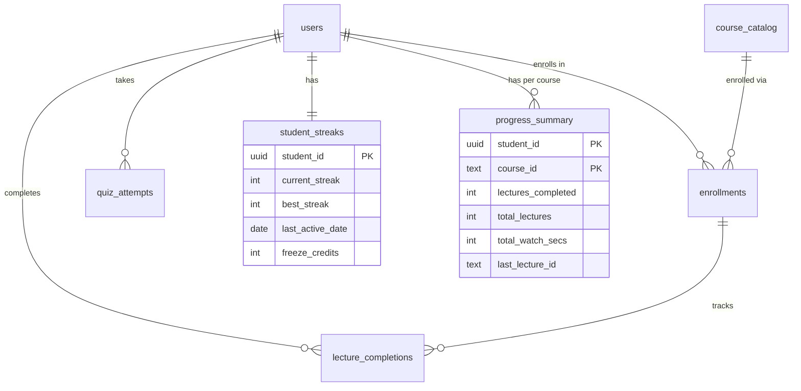
```mermaid
erDiagram
    users ||--o{ enrollments : "enrolls in"
    users ||--o{ lecture_completions : "completes"
    users ||--o{ quiz_attempts : "takes"
    users ||--|| student_streaks : "has"
    users ||--o{ progress_summary : "has per course"
    course_catalog ||--o{ enrollments : "enrolled via"
    enrollments ||--o{ lecture_completions : "tracks"
    progress_summary {
        uuid student_id PK
        text course_id PK
        int lectures_completed
        int total_lectures
        int total_watch_secs
        text last_lecture_id
    }
    student_streaks {
        uuid student_id PK
        int current_streak
        int best_streak
        date last_active_date
        int freeze_credits
    }
```

---

## Chunk 5 — Placement Module

**Goal**: End-to-end company drive management, AI mock interviews, GD sessions, and readiness score computation.

### How it Works: Drive Registration State Machine

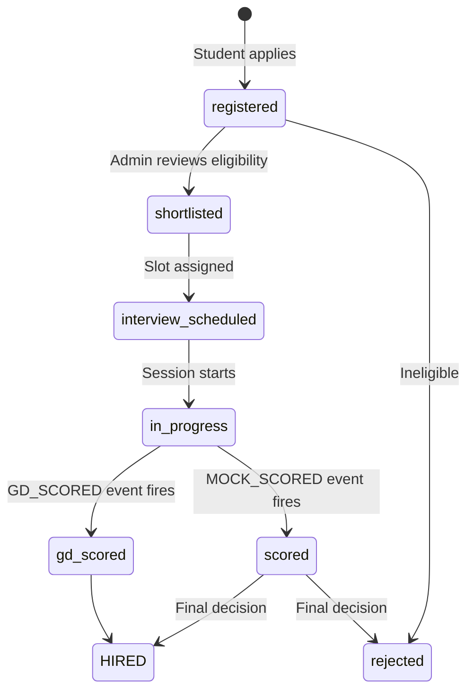
```mermaid
stateDiagram-v2
    [*] --> registered : Student applies
    registered --> shortlisted : Admin reviews eligibility
    registered --> rejected : Ineligible
    shortlisted --> interview_scheduled : Slot assigned
    interview_scheduled --> in_progress : Session starts
    in_progress --> scored : MOCK_SCORED event fires
    in_progress --> gd_scored : GD_SCORED event fires
    scored --> HIRED : Final decision
    gd_scored --> HIRED
    scored --> rejected : Final decision
```

### How it Works: Placement Schema Relationships

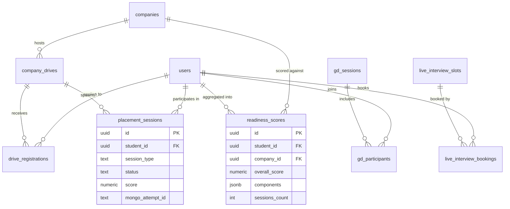
```mermaid
erDiagram
    companies ||--o{ company_drives : "hosts"
    company_drives ||--o{ drive_registrations : "receives"
    users ||--o{ drive_registrations : "applies to"
    company_drives ||--o{ placement_sessions : "spawns"
    users ||--o{ placement_sessions : "participates in"
    users ||--o{ readiness_scores : "aggregated into"
    companies ||--o{ readiness_scores : "scored against"
    gd_sessions ||--o{ gd_participants : "includes"
    users ||--o{ gd_participants : "joins"
    live_interview_slots ||--o{ live_interview_bookings : "booked by"
    users ||--o{ live_interview_bookings : "books"

    placement_sessions {
        uuid id PK
        uuid student_id FK
        text session_type
        text status
        numeric score
        text mongo_attempt_id
    }
    readiness_scores {
        uuid id PK
        uuid student_id FK
        uuid company_id FK
        numeric overall_score
        jsonb components
        int sessions_count
    }
```

### How it Works: Readiness Score Computation (CDC 7.7)

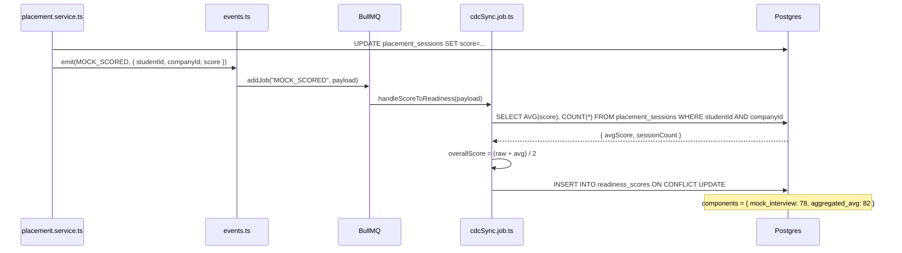
```mermaid
sequenceDiagram
    participant PlS as placement.service.ts
    participant EE as events.ts
    participant BQ as BullMQ
    participant CDC as cdcSync.job.ts
    participant PG as Postgres

    PlS->>PG: UPDATE placement_sessions SET score=...
    PlS->>EE: emit(MOCK_SCORED, { studentId, companyId, score })
    EE->>BQ: addJob("MOCK_SCORED", payload)

    BQ->>CDC: handleScoreToReadiness(payload)
    CDC->>PG: SELECT AVG(score), COUNT(*) FROM placement_sessions WHERE studentId AND companyId
    PG-->>CDC: { avgScore, sessionCount }
    CDC->>CDC: overallScore = (raw + avg) / 2
    CDC->>PG: INSERT INTO readiness_scores ON CONFLICT UPDATE
    Note over PG: components = { mock_interview: 78, aggregated_avg: 82 }
```

---

## Chunk 6 — Exam Module

**Goal**: Secure, time-bound exam sessions with dual-database response storage and real-time proctoring.

### How it Works: Exam Attempt Lifecycle

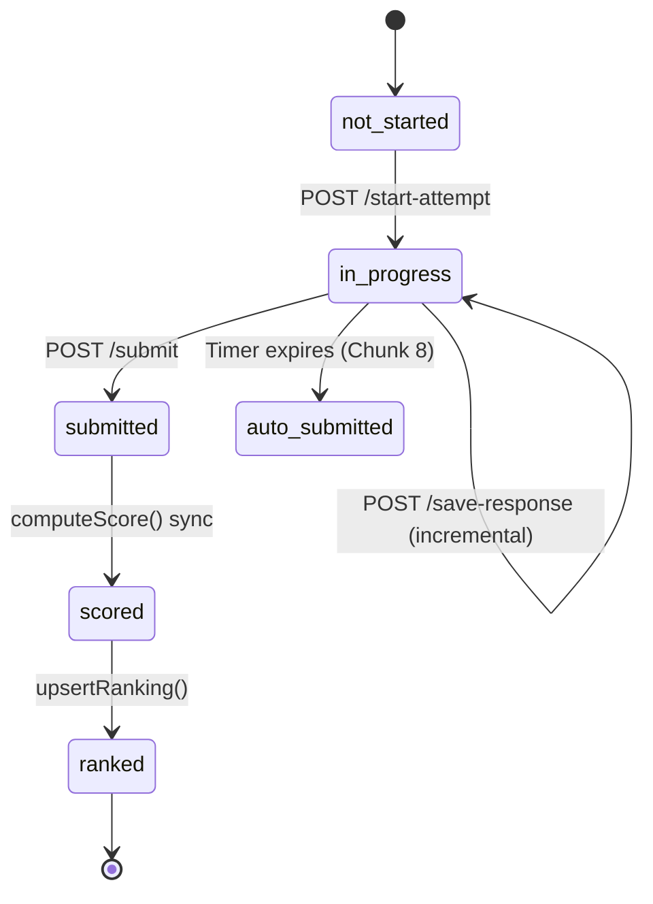
```mermaid
stateDiagram-v2
    [*] --> not_started
    not_started --> in_progress : POST /start-attempt
    in_progress --> in_progress : POST /save-response (incremental)
    in_progress --> submitted : POST /submit
    submitted --> scored : computeScore() sync
    scored --> ranked : upsertRanking()
    ranked --> [*]
    in_progress --> auto_submitted : Timer expires (Chunk 8)
```

### How it Works: Submit & Score Pipeline

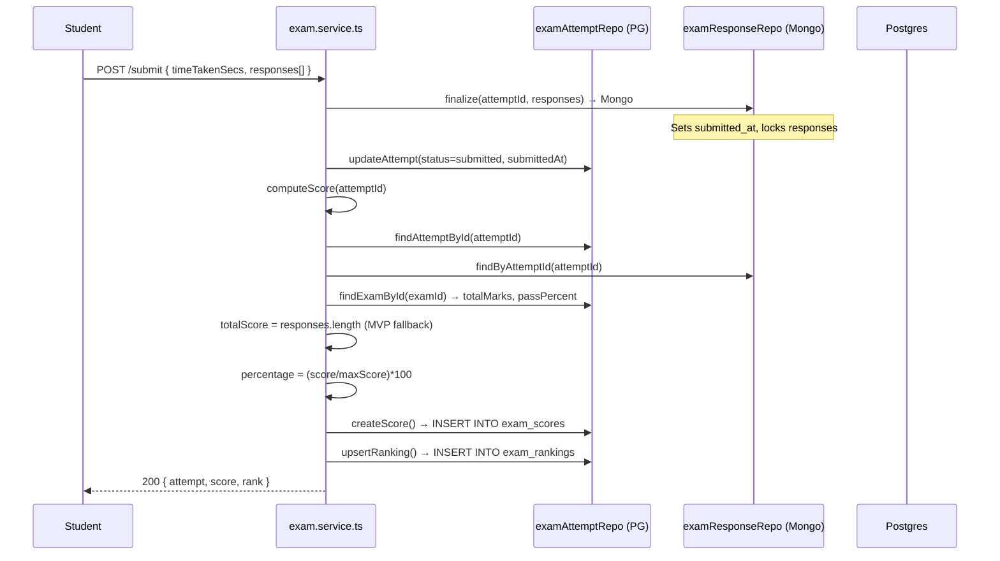
```mermaid
sequenceDiagram
    participant S as Student
    participant ES as exam.service.ts
    participant EAR as examAttemptRepo (PG)
    participant ERR as examResponseRepo (Mongo)
    participant PG as Postgres

    S->>ES: POST /submit { timeTakenSecs, responses[] }
    ES->>ERR: finalize(attemptId, responses) → Mongo
    Note over ERR: Sets submitted_at, locks responses
    ES->>EAR: updateAttempt(status=submitted, submittedAt)
    ES->>ES: computeScore(attemptId)
    ES->>EAR: findAttemptById(attemptId)
    ES->>ERR: findByAttemptId(attemptId)
    ES->>EAR: findExamById(examId) → totalMarks, passPercent
    ES->>ES: totalScore = responses.length (MVP fallback)
    ES->>ES: percentage = (score/maxScore)*100
    ES->>EAR: createScore() → INSERT INTO exam_scores
    ES->>EAR: upsertRanking() → INSERT INTO exam_rankings
    ES-->>S: 200 { attempt, score, rank }
```

### How it Works: Proctoring Event Ingestion

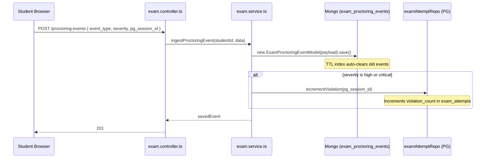
```mermaid
sequenceDiagram
    participant FE as Student Browser
    participant EC as exam.controller.ts
    participant ES as exam.service.ts
    participant MG as Mongo (exam_proctoring_events)
    participant EAR as examAttemptRepo (PG)

    FE->>EC: POST /proctoring-events { event_type, severity, pg_session_id }
    EC->>ES: ingestProctoringEvent(studentId, data)
    ES->>MG: new ExamProctoringEventModel(payload).save()
    Note over MG: TTL index auto-clears old events
    alt severity is high or critical
        ES->>EAR: incrementViolation(pg_session_id)
        Note over EAR: Increments violation_count in exam_attempts
    end
    ES-->>EC: savedEvent
    EC-->>FE: 201
```

---

## Chunk 7 — Cross-Cutting Services

**Goal**: A zero-coupling event bus. Services emit domain events; the CDC worker handles cross-DB synchronization transparently.

### How it Works: The Full CDC Pipeline

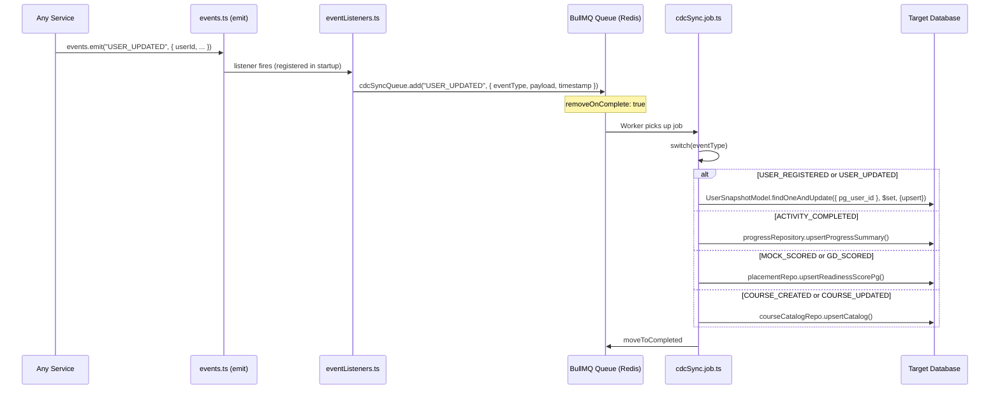
```mermaid
sequenceDiagram
    participant Svc as Any Service
    participant EI as events.ts (emit)
    participant EL as eventListeners.ts
    participant BQ as BullMQ Queue (Redis)
    participant Wkr as cdcSync.job.ts
    participant Target as Target Database

    Svc->>EI: events.emit("USER_UPDATED", { userId, ... })
    EI->>EL: listener fires (registered in startup)
    EL->>BQ: cdcSyncQueue.add("USER_UPDATED", { eventType, payload, timestamp })
    Note over BQ: removeOnComplete: true
    BQ->>Wkr: Worker picks up job
    Wkr->>Wkr: switch(eventType)
    alt USER_REGISTERED or USER_UPDATED
        Wkr->>Target: UserSnapshotModel.findOneAndUpdate({ pg_user_id }, $set, {upsert})
    else ACTIVITY_COMPLETED
        Wkr->>Target: progressRepository.upsertProgressSummary()
    else MOCK_SCORED or GD_SCORED
        Wkr->>Target: placementRepo.upsertReadinessScorePg()
    else COURSE_CREATED or COURSE_UPDATED
        Wkr->>Target: courseCatalogRepo.upsertCatalog()
    end
    Wkr->>BQ: moveToCompleted
```

### How it Works: Event Registry

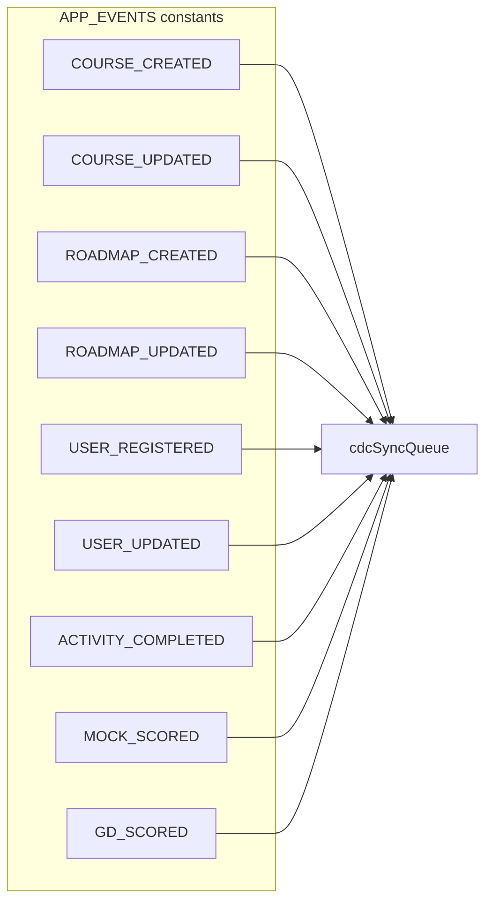
```mermaid
flowchart LR
    subgraph APP_EVENTS constants
        CE[COURSE_CREATED]
        CU[COURSE_UPDATED]
        RC[ROADMAP_CREATED]
        RU[ROADMAP_UPDATED]
        UR[USER_REGISTERED]
        UU[USER_UPDATED]
        AC[ACTIVITY_COMPLETED]
        MS[MOCK_SCORED]
        GS[GD_SCORED]
    end

    CE --> cdcSyncQueue
    CU --> cdcSyncQueue
    RC --> cdcSyncQueue
    RU --> cdcSyncQueue
    UR --> cdcSyncQueue
    UU --> cdcSyncQueue
    AC --> cdcSyncQueue
    MS --> cdcSyncQueue
    GS --> cdcSyncQueue
```

---

## Chunk 8 — Real-Time & Production Readiness (Active)

**Goal**: Upgrade from REST to live bidirectional communication using Socket.io namespaces.

### How it Works: Socket.io Namespace Architecture

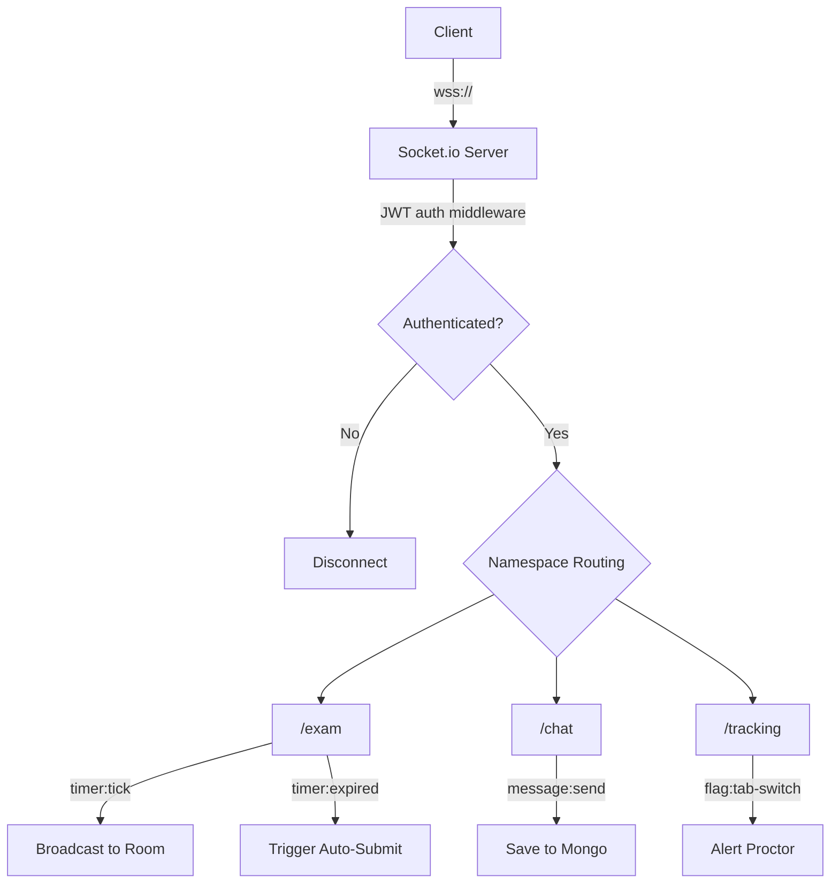
```mermaid
flowchart TD
    Client -- "wss://" --> SocketServer[Socket.io Server]
    SocketServer -- "JWT auth middleware" --> Auth{Authenticated?}
    Auth -- No --> Disconnect
    Auth -- Yes --> NS{Namespace Routing}
    NS --> ExamNS["/exam"]
    NS --> ChatNS["/chat"]
    NS --> TrackingNS["/tracking"]

    ExamNS -- "timer:tick" --> Broadcast[Broadcast to Room]
    ExamNS -- "timer:expired" --> AutoSubmit[Trigger Auto-Submit]
    ChatNS -- "message:send" --> Store[Save to Mongo]
    TrackingNS -- "flag:tab-switch" --> Alert[Alert Proctor]
```

### How it Works: Planned Exam Timer Sync

```mermaid
sequenceDiagram
    participant S as Student Browser
    participant IO as Socket.io (/exam)
    participant Redis as Redis (Timer State)
    participant API as REST API

    S->>IO: connect + join room exam:attemptId
    IO->>Redis: GET timer:attemptId
    Redis-->>IO: { remainingSecs, startedAt }
    IO-->>S: timer:init { remainingSecs }
    loop Every second
        IO->>S: timer:tick { remainingSecs-- }
    end
    IO->>S: timer:expired
    IO->>API: trigger auto-submit (attemptId)
```

---

## Architectural Principles

| Principle | Pattern | Files |
|---|---|---|
| Separation of Concerns | Controller → Service → Repository | `*.controller.ts`, `*.service.ts`, `*.repository.ts` |
| Stateless API | No in-memory state; all stored in Redis/DB | `src/config/redis.ts` |
| Fail-Fast Validation | Zod schemas at route entry | `*.schemas.ts` → `validate.ts` middleware |
| Eventual Consistency | CDC via BullMQ | `eventListeners.ts`, `cdcSync.job.ts` |
| Security-First | SHA256 token hashing, RBAC headers | `auth.service.ts`, `middleware/auth.ts` |
