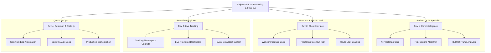

# Project Team Assignments: Phase 9-P (Proctoring) & Phase 10

This document re-aligns the team for the **Phase 9-P (AI Proctoring)** sprint and the subsequent **Phase 10 (Testing & Deployment)**.

---

## 👨‍💻 Developer 1: Backend & AI Specialist
**Focus**: *Intelligence, Violation Scoring, and Async Processing*

- [ ] **AI Proctoring Core**: Integrate the external AI behavior analysis API (Gaze detection, Object recognition).
- [ ] **Risk Scoring Engine**: Develop the logic to aggregate violation events into a weighted "Risk Score" (0-100).
- [ ] **BullMQ Job Processing**: Implement the background worker to process high-frequency frame buffers from the `/tracking` stream.
- [ ] **Advanced Audit**: Finalize role-based access for proctoring reports in the Admin panel.

---

## 🎨 Developer 2: Frontend & UI/UX Lead
**Focus**: *Proctoring HUD, Media Capture, and Performance*

- [ ] **Exam Media Capture**: Implement the frame-capture loop in the `ExamInterface` (Canvas -> Base64 snippets).
- [ ] **Proctoring HUD**: Design and build the student-facing "Secure Mode" overlay with status indicators and violation warnings.
- [ ] **Performance Optimization**: Implement `React.lazy()` and `<Suspense>` across major routes to shrink the 859KB bundle.
- [ ] **UI Refinement**: Ensure the Interview Room and Exam Interface maintain a premium "Midnight Navy" glassmorphism aesthetic.

---

## ⚡ Developer 3: Real-Time & Integration Engineer
**Focus**: *Tracking Sockets, Live Feeds, and Eventing*

- [ ] **Tracking Namespace Upgrade**: Enhance the `/tracking` socket to handle binary frame data and proctoring event emissions.
- [ ] **Live Proctored Dashboard**: Build the real-time admin view for monitoring multiple active candidates with risk-level color coding.
- [ ] **Event Broadcast System**: Wire the frontend to emit "tab-switch", "exit-fullscreen", and "copy-paste" attempts to the backend.
- [ ] **State Sync**: Ensure proctoring-triggered "auto-termination" syncs correctly with the exam completion state.

---

## 🛡️ Developer 4: QA, Security & DevOps Engineer
**Focus**: *Selenium Automation, Security Audits, and CI/CD*

- [ ] **Selenium E2E Automation**: Build the automated testing suite covering the "Candidate Journey" (Register -> Enroll -> AI-Proctored Exam -> Submit).
- [ ] **Security Penetration Test**: Audit new proctoring endpoints for SQLi/XSS and verify rate-limiting on frame submissions.
- [ ] **CI/CD Pipeline**: Finalize the production Docker deployment scripts for `ugskill-api` and `ugskill-web`.
- [ ] **Audit Logging**: Verify that every proctoring violation and manual override is captured with a timestamped log.

---

### Sprint Protocol
1. **Critical Path**: Dev 1 and Dev 2 must sync daily on the frame submission payload structure.
2. **E2E Priority**: Selenium tests (Dev 4) should be written in parallel with feature development to catch regressions early.
3. **Emergency Halt**: Any proctoring logic that triggers auto-termination must be reviewed by the full team to avoid false positives.
