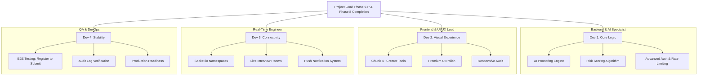

# Project Team Assignments: Phase 9 & Final Polish

This document outlines the division of labor for the upcoming development sprint, focusing on the transition from **Phase 8 (API Integration)** to **Phase 9-P (AI Proctoring Engine)**.

---

## 👨‍💻 Developer 1: Backend & AI Specialist
**Focus**: *Intelligence, Security, and Core Logic*

- [ ] **AI Proctoring Engine (Phase 9-P)**: Implement the core proctoring logic using external AI APIs for behavior analysis.
- [ ] **Risk Scoring Algorithm**: Develop the backend logic to calculate "Risk Scores" based on gaze tracking, eye movement, and object detection events.
- [ ] **Advanced Auth**: Implement JWT rotation and rate-limiting for sensitive admin/creator endpoints.
- [ ] **API Performance**: Optimize PostgreSQL and MongoDB queries for the Analytics and Placements modules.

-

## 🎨 Developer 2: Frontend & UI/UX Lead
**Focus**: *Creator Tools and Visual Excellence*

- [ ] **Chunk I7: Creator Tools**: Finalize the `CourseBuilder` and `QuizBuilder` interfaces. Ensure full save/edit functionality for modules and questions.
- [ ] **Phase 9-P Frontend**: Integrate the proctoring "Client" (webcam stream handling and local event detection).
- [ ] **UI Polish**: Implement modern design tokens across any remaining basic pages. Ensure premium "WOW" factor on dashboards.
- [ ] **Responsive Audit**: Verify all new LMS and Exam layouts work perfectly on tablet and mobile.

---

## ⚡ Developer 3: Real-Time & Integration Engineer
**Focus**: *Live Events, Community, and Connectivity*

- [ ] **Socket.io Finalization**: Ensure the 5 real-time namespaces (`/exams`, `/placements`, `/community`, `/chat`, `/tracking`) are fully robust.
- [ ] **Live Interview Room**: Fine-tune the Peer-to-Peer or SFU video logic for mock interviews.
- [ ] **Notifications System**: Build the push-notification handler for community mentions and placement alerts.
- [ ] **State Management**: Refactor `DashboardStore` and `AuthStore` to handle high-frequency real-time updates without performance lag.

---

## 🛡️ Developer 4: QA, Security & DevOps Engineer
**Focus**: *Stability, Verification, and Deployment*

- [ ] **Chunk I10: E2E Testing**: Execute the "Register → Enroll → Proctoring → Submit" test flow across all environments.
- [ ] **Cross-Browser Validation**: Ensure consistency across Chrome, Safari, and Firefox (critical for webcam/proctoring).
- [ ] **Audit Logging**: Verify that all administrative actions (role changes, batch access) are correctly captured in the audit logs.
- [ ] **Production Readiness**: Monitor the `ugskill-api` and `ugskill-web` production builds for memory leaks or socket disconnects.

---

### Collaboration Protocol
1. **Source of Truth**: Refer to `TODO.md` for specific technical requirements.
2. **Branching**: Use feature branches (e.g., `feature/proctoring-engine`) for major changes.
3. **Communication**: All real-time socket events should be documented in the repository's `REALTIME.md` (to be created if needed).
